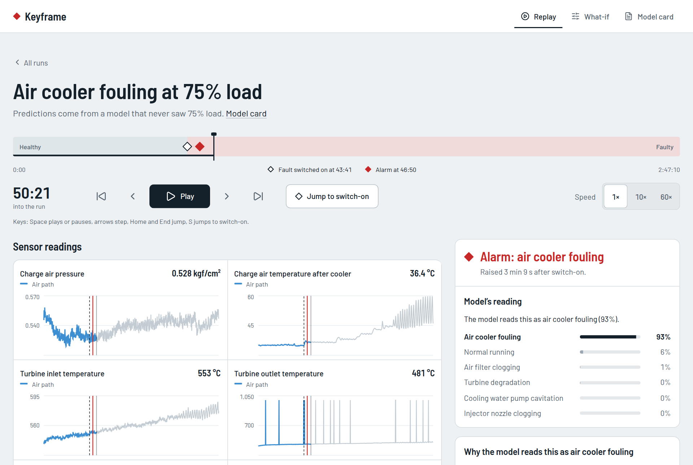
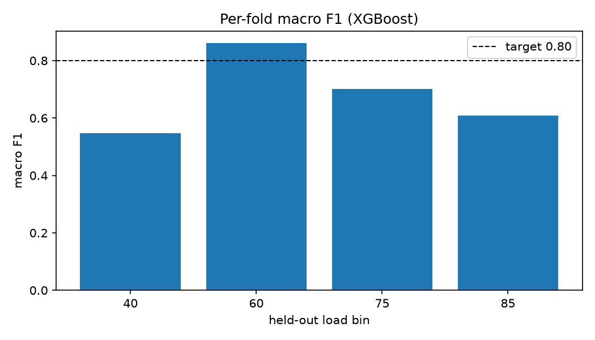
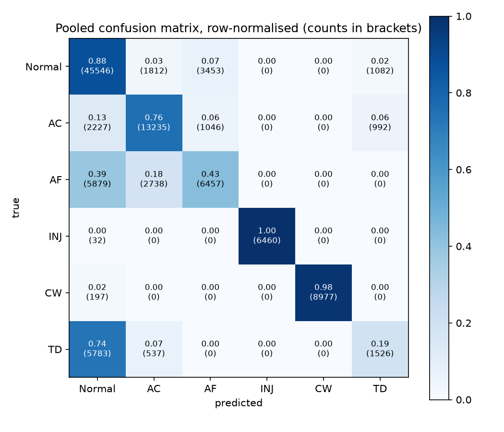

# Keyframe

Keyframe diagnoses faults on a marine diesel engine from its sensor readings, and is scored only on engine loads it never saw in training.

In animation, a keyframe marks the frame where something changes. Keyframe's job is to catch the moment an engine goes from healthy to faulty, name the likely cause, and show which readings led it there.



## What it found

The best model, XGBoost on raw readings plus physics features and rolling windows, reaches a **macro F1 of 0.717 on held-out engine loads**, up from 0.44 for the first baseline but short of the 0.80 target. **Two of the nine targets set before modelling are met.** Scores were locked on 29 September 2026 ([ADR 0009](docs/adr/0009-results-locked.md)) and are reported as they came out.

| Measure | Result | Target | |
|---|---:|---:|---|
| Macro F1 on held-out loads | 0.717 | 0.80 | not met |
| Lowest per-class recall (turbine degradation) | 0.194 | 0.70 | not met |
| False alarm rate | 12.2% | 5% | not met |
| Detection delay, median of runs that alarmed | 9 min 23 s | 10 min | not met: only 6 of 13 fault runs raise an alarm |
| Fault detection AUROC, healthy-only detectors | 0.528 | 0.95 | not met |
| Expected calibration error | 0.176 | 0.05 | not met |
| Unseen fault severity (two-hole injector, scored once) | 100% | 90% | met, but weak evidence: the model predicted only injector clogging there |
| Physics check on explanations | 2 of 5 faults | 4 of 5 | not met |
| Demo response time, prediction plus explanation | 148 ms | 300 ms | met |

What that means in engineering terms:

- **Two faults are learned from the right physics.** Air cooler fouling is recognised from charge air temperature after the cooler, and injector clogging from the exhaust temperature spread between cylinders, as the engineering checklist written before any modelling said they should be ([physics check](reports/physics_check.md)).
- **Two faults are partly recognised by the test day, not the fault.** Air filter clogging and cooling water pump cavitation lean on channels that drift with the day of testing (fuel temperatures, sea cooling water pressure). Remove the 40 day-dependent features and cavitation recall at 60% load falls from 0.96 to 0.
- **Turbine degradation is the weakest class** (recall 0.19), and the explanations for it point at lube oil and efficiency channels rather than the turbine.
- **Scores swing with the held-out load:** macro F1 is 0.55, 0.86, 0.70 and 0.61 at 40, 60, 75 and 85% load. The 85% model is underfit because its tuning ran only 9 trials; it was found after the lock and left in, not quietly fixed ([ADR 0011](docs/adr/0011-fold-85-underfit.md)).
- **Anomaly detectors trained on healthy running alone are near chance** (AUROC 0.53), so the classifier cannot be replaced by "flag anything unusual" on this data.
- **Physics features and rolling windows earned their place:** on the same model family, pooled macro F1 rises from 0.39 (raw readings) to 0.57 (plus physics) to 0.62 (plus rolling windows).

<p>
  
  
</p>

The full account, with every limit, is the [model card](reports/model_card.md). The method and results are written up as a paper in [`paper/`](paper/) (`cd paper && latexmk -pdf main.tex`); every number in it is generated from the results files by `paper/make_data.py`.

## How it was tested

- **Leave one load out.** The engine was run at 40, 60, 75 and 85% load. Each score comes from a model trained on the other loads, with hyperparameters tuned only inside those training loads (nested). Random row splits are never used: readings two seconds apart are nearly identical, so a random split scores a meaningless 1.00.
- **Checklist before model.** What each fault should do to the sensors was written down and its hash pinned before any model saw the data ([engineering checklist](reports/engineering_checklist.md)). Explanations are scored against it.
- **Targets fixed in advance.** The nine targets were set in the brief and reviewed once after the exploratory analysis, without change ([targets review](reports/targets.md)).
- **One lockbox.** A run with two injector holes plugged, a worse fault than any in training, was set aside at download and scored once, after every choice was fixed.
- **Alarm, not single readings.** An alarm needs the same fault predicted for a sustained stretch, with the stretch and threshold chosen inside the training loads.

## Try the demo

The demo replays real test-bench runs with predictions from the held-out model: play a fault run, see when the alarm fires, pause to read why, change readings in the what-if screen, and open the model card.

```bash
npm --prefix web ci
npm --prefix web run dev                       # http://localhost:5173
uv run uvicorn api.main:app --port 8000        # in a second terminal; the what-if screen needs it
```

Replay and model card are static files, so `npm --prefix web run build` produces a site that runs on any static host. The API serves `/health`, `/runs`, `/predict`, `/explain` and `/whatif/baselines`; a prediction takes about 90 ms and a prediction with its explanation about 150 ms.

## Reproduce it

You need [uv](https://docs.astral.sh/uv/) and, for the demo, Node 22. Everything else is pinned in `uv.lock` and `web/package-lock.json`.

```bash
uv sync                               # Python 3.12 and every package, at pinned versions
uv run python -m keyframe.download    # fetch dataset v1.0 from Zenodo, verify its checksum
uv run pytest                         # run the tests
bash scripts/reproduce.sh             # rebuild every result, figure and demo file (several hours)
```

`scripts/reproduce.sh` runs the heavy experiments in the order they were made, then re-executes the notebooks, which read those results. Each experiment skips work whose output already exists. The tuned hyperparameters are committed in `models/tuning/`, so a rebuild uses the same parameters as the locked results; delete that folder to re-tune, knowing that tuning runs on a time budget and a different machine may land elsewhere.

The notebooks tell the story in order: `00_data_audit`, `01_eda`, `02_baselines`, `03_feature_engineering`, `04_modelling`, `05_anomaly_detection`, `06_explainability`, `07_evaluation`, `08_export`. Each opens with what it asks and what it found.

## Repository

```
keyframe/     shared Python package: download, loading, splits, features, models, explanations
notebooks/    00_data_audit … 08_export (jupytext .py source + executed .ipynb)
scripts/      reproduce.sh
paper/        the write-up as a LaTeX preprint, with its generated numbers and plot data
tests/        pytest, including checks that no split mixes engine loads
reports/      figures, results tables, engineering checklist, physics check, model card
models/       exported model, tuned parameters, replay files, what-if baselines
api/          FastAPI service
web/          TypeScript demo: replay, explain, what-if, model card
specs/        project brief, mission, tech stack, roadmap, feature specs
docs/         design manifesto, design plan and architecture decision records
```

## Data and credit

Real test-bench data from a Matsui Iron Works MU323DGSC marine diesel: 14 fault runs across five fault types at 40 to 85% load, a two-hole injector run kept back as the lockbox, and 25,302 rows of healthy reference running.

| Fault | What was done to the engine |
| --- | --- |
| Air cooler fouling | Charge air cooling degraded |
| Air filter clogging | Compressor inlet filter gradually covered |
| Injector nozzle clogging | One nozzle hole plugged |
| Cooling water pump cavitation | Air injected at the pump suction |
| Turbine degradation | Exhaust back pressure raised after the turbine |

The Marine Engine Fault Dataset, version 1.0, is released under [CC BY 4.0](https://creativecommons.org/licenses/by/4.0/). Please cite both:

- BahooToroody, A., Bondarenko, O., Abaei, M. M., Niki, Y., & Zio, E. (2026). Marine Engine Fault Dataset (Version 1.0) [Data set]. Zenodo. https://doi.org/10.5281/zenodo.19857425
- BahooToroody, A., Bondarenko, O., Abaei, M. M., Niki, Y., & Zio, E. (2026). Marine Engine Fault Dataset: Open-Access Data under Controlled Reference and Fault Scenario Conditions. Preprint, arXiv:2607.19444.

## Limits

Keyframe has been tested on bench data from one small engine at steady loads, with 14 fault runs; turbine degradation and cavitation have only 3 and 2. **It has not been tested on a ship** and must not be used for operating or maintenance decisions. Its confidence is not calibrated, and part of its score comes from recognising the test day. The [model card](reports/model_card.md) lists every limit.

Keyframe follows [Marine AIMS](https://github.com/MrNahadi), an earlier project on synthetic data. Synthetic engine data had no correlation between sensors and faults lasting one second; this project moves the same goal onto real measurements, where the physics holds together and faults develop over time.
