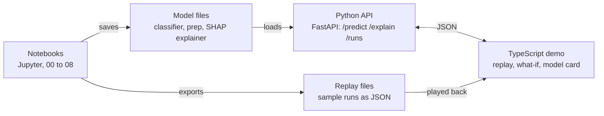

# Project brief: Keyframe

<!--
Restructured from specs/brief.original.md (Farid's own brief, kept verbatim) into the spec-ralph template on 28 September 2026.
Wording is Farid's wherever it existed. Lines the agent drafted are marked, with how they were confirmed.
The long technical sections of the original (dataset, validation protocol, workflow, explainability, front end, risks) are kept verbatim in the appendices.
-->

| Field | Value |
|---|---|
| Version | 1.0 |
| Date | 2026-09-28 |
| Owner | Farid Muigu |
| Project type | greenfield |

## 1. Summary

Keyframe is a machine learning model that diagnoses faults on a marine diesel engine from its sensor readings, and keeps working at engine loads it never saw in training. It will be built in Jupyter notebooks first, then shown through a small web demo written in TypeScript. It is for engineers at engine makers such as Wärtsilä (and, secondarily, a Masters admissions panel), who should be able to see in five minutes that it shows marine engineering judgement applied to machine learning on real engine data. It lets them watch a real engine run go from healthy to faulty, see when Keyframe raised the alarm and read which readings led it there.

## 2. Problem and why now

Engine room alarm systems mostly trip when one reading crosses a fixed limit, by which point the fault is usually well developed. A model that reads the pattern across many sensors can flag a fault earlier, name its likely cause, and explain which readings led it there.

Keyframe is the next step after Marine AIMS, my final year project, which trained a fault model on a synthetic Kaggle dataset. Synthetic engine datasets tend to be generated as independent random noise per sensor, with each fault added as a fixed offset. The Kaggle set checked on 28 September 2026 showed exactly that: no correlation between sensors above 0.04, no link between one reading and the next, and faults lasting a single second. A model trained on data like that can score well without learning anything about how an engine behaves.

Why now: the Marine Engine Fault Dataset v1.0 (real test-bench data, CC BY 4.0) became available, bringing physics that holds together, faults that develop over time, different loads and explanations worth checking (see the appendix section "Where this builds on Marine AIMS").

## 3. Users

| User | Primary? | What they need | What they already know |
|---|---|---|---|
| Engineer or recruiter at an engine maker (e.g. Wärtsilä) | yes (owner, 28 Sep 2026) | To judge in about five minutes whether the work shows sound marine engineering judgement and honest ML: play a fault run, see the alarm and its delay, read why it fired, check the metrics and limits | Marine diesel engines, sensors and fault behaviour; basic ML vocabulary. Not this dataset or the project's jargon |
| Masters admissions panel | no | Evidence of research method: fixed targets, leakage-free validation, reported spread, a model card with limits | ML and research method; maybe not engines |
| Farid (owner) | no | A portfolio piece and a rebuilt, trustworthy version of Marine AIMS | Everything above |

## 4. Goals and success measures

The headline target is a macro F1 of 0.80 on engine loads the model never trained on, up from 0.52 in the first baseline. Every number is measured on held-out loads (appendix section "Validation protocol"), never on a random split. Full table with baselines and stretch targets: appendix section "Goals and success metrics".

| Goal | How we'll know |
|---|---|
| Diagnose faults at unseen loads | Macro F1 on leave-one-load-out ≥ 0.80 (stretch 0.90) |
| The weakest fault still gets caught | Lowest per-class recall ≥ 0.70 (stretch 0.85) |
| Few false alarms | Share of healthy rows flagged as a fault ≤ 5% (stretch 2%) |
| Detect faults from healthy data alone | Fault detection AUROC ≥ 0.95 (stretch 0.98) |
| Catch faults early | Median time from switch-on to first sustained alarm ≤ 10 min (stretch 5 min) |
| Honest confidence | Expected calibration error ≤ 0.05 (stretch 0.03) |
| Generalise to a worse fault | Two-hole injector lockbox run labelled injector fault ≥ 90% (stretch 97%) |
| Explanations match the physics | Top 5 SHAP features match the pre-registered engineering checklist for ≥ 4 of 5 faults (stretch 5 of 5) |
| Responsive demo | One prediction plus its explanation in the browser ≤ 300 ms (stretch 100 ms) |

Accuracy is reported but is not a target. These targets are fixed now, before modelling starts. They can be revised once, after the EDA, with the reason written down. They are never changed after seeing test results.

## 5. Scope

### In scope

1. A fresh clone rebuilds the data folder with one command (download from Zenodo, checksum verified, lockbox file set aside).
2. A reader can open a data audit that loads all 16 files into one clean table and documents units, gaps, missing channels and every fault switch-on point.
3. A reader can see each fault compared against healthy running at the same load, and a written engineering checklist of what each fault should do to the sensors, committed before any model sees the data.
4. A reader can see baseline models scored on leave-one-load-out splits, reproducing a macro F1 near 0.52.
5. A reader can see an ablation table showing which feature sets (healthy-engine residuals, physics features, rolling windows) earn their place.
6. A reader can see models compared with nested tuning, with alarm logic that raises a fault only after several consecutive windows agree.
7. A reader can see healthy-only anomaly detectors scored by AUROC and detection delay.
8. A reader can see SHAP explanations per class, per moment and per sensor group, a LIME comparison, and each fault checked against the engineering checklist.
9. A reader can read final held-out-load scores with spread, a calibration check, the lockbox result and a one-page model card.
10. A clean Python session can load the exported final model and reproduce a prediction; replay files exist for the demo.
11. A client can get a prediction plus explanation from a FastAPI service (/predict, /explain, /runs) in under 300 ms.
12. Anyone can play a fault run in the web demo, see the alarm and its delay, pause to read why it fired, try what-if sliders and open the model card.
13. A visitor can read a README with results, dataset citation and how to reproduce everything.

### Out of scope

<!-- Proposed by the agent on 28 Sep 2026; the owner was shown this list and did not change it. -->
- Deployment on a real ship or onboard use, and live sensor feeds (the demo is a showcase, not an onboard tool).
- User accounts, sign in, or saved sessions in the demo.
- Other engines or datasets beyond the Marine Engine Fault Dataset v1.0.
- Retraining or tuning the model from the web demo.
- A native mobile app (the web demo must still work at phone width).

## 6. Key user flows

### Flow: Replay a fault run

1. Pick a run, such as turbine degradation at 85% load.
2. Play it at 1x, 10x or 60x.
3. Watch live sensor traces and fault probability bars; see the alarm when it fires and how long after the real switch-on it came.

### Flow: Explain a moment

1. Pause at any moment of a replay.
2. See a SHAP waterfall for that reading, grouped by air path, fuel, cooling and lube oil.

### Flow: What-if

1. Set a load.
2. Move sliders for key readings.
3. See the diagnosis and its explanation update as the readings change.

### Flow: Check the model card

1. Open the about page.
2. Read metrics, confusion matrix, dataset credit and known limits.

## 7. Glossary

| Term | Meaning in this project |
|---|---|
| Run | One CSV file of the dataset: one fault at one load (or a load program), 2 to 3 hours |
| Switch-on (onset) | The first row of a run where `Anomaly State` = 1 |
| Load bin | 40, 60, 75 or 85% load, assigned per row by shaft power with cut points 130, 175 and 207 kW |
| Leave one load out (LOLO) | Train on three load bins, test on the fourth, repeat four times, pool predictions |
| Held-out load | The load bin left out in a LOLO fold |
| Lockbox | `Clogged_Injector_Nozzle2_LoadProgram.csv`, set aside at the start and used once at the end |
| Healthy-engine residual | Measured reading minus what a model trained on healthy reference data predicts from speed, brake load and fuel flow |
| Engineering checklist | The written list of what each fault should do to the sensors, drafted at the end of the EDA before any model sees the data |
| Sustained alarm | A fault raised only after several consecutive windows agree |
| Detection delay | Median time from fault switch-on to the first sustained alarm |
| False alarm rate | Share of healthy rows flagged as a fault |
| Macro F1 | F1 averaged over the six classes with equal weight |
| Classes | Normal, AC (air cooler fouling), AF (air filter clogging), INJ (injector nozzle clogging), CW (cooling water pump cavitation), TD (turbine degradation) |

## 8. Non-negotiables

- No random row splits, anywhere. Every reported number comes from held-out loads.
- Scalers, the healthy-engine reference model and feature selection are fitted inside each training fold only. Rolling windows never cross file boundaries.
- Compressor filter loss (dPf), turbine back pressure (dPex), engine room temperature and time columns are never model inputs.
- The lockbox run is used once, at the end.
- Targets are fixed before modelling, revised at most once after the EDA with the reason written down, and never changed after seeing test results. Scores are not changed after milestone 10.
- Raw data stays out of Git; a download script fetches the pinned version 1.0 from Zenodo and checks it against a stored checksum.
- The CC BY 4.0 licence requires credit: the README and model card cite both the dataset and the data descriptor.
- The model card states that Keyframe has not been tested on a ship.
- Python 3.12 or newer.
- The front end follows the design manifesto (`docs/design/manifesto.md`), in particular its rules sheet (Part 14) and screen audit (Part 15).

## 9. Tech preferences

| Area | Required | Preferred | Avoid | No opinion |
|---|---|---|---|---|
| Language | Python ≥ 3.12 (notebooks, package, API); TypeScript (front end) | | | |
| Notebooks and environment | JupyterLab | uv or conda with pinned versions | | |
| Data | pandas, NumPy, Parquet (pyarrow) | | | |
| Modelling | scikit-learn | LightGBM or XGBoost, Optuna for tuning | | |
| Explainability | shap | lime (one comparison only) | | |
| Plots | | matplotlib, plotly | | |
| Experiment log | | A results CSV per experiment; MLflow if it grows | | |
| Testing | pytest on the `keyframe` package, including a test that no split mixes loads | | | |
| API | FastAPI, Uvicorn, pydantic | | | |
| Model export | joblib | skl2onnx or onnxmltools for the in-browser stretch | | |
| Front-end framework | | | | React + Vite, SvelteKit or Vue; decide at milestone 13 |
| Hosting / distribution | Public GitHub repository | | | Where the API and demo are hosted |

## 10. Ranked trade-offs

1. Honest evaluation (no leakage, targets fixed before results)
2. Engineering credibility of the explanations
3. Reproducibility
4. Simplicity of the code
5. Demo experience
6. Speed of delivery

Honest evaluation is far above everything else. (Order chosen by the owner, 28 Sep 2026.)

## 11. Quality bar

- Tests: pytest on the `keyframe` package, including a test that no split mixes loads; every shared function used by the notebooks has a test.
- Performance: one prediction plus its explanation in under 300 ms.
- Accessibility: the front end meets the manifesto's baseline: WCAG AA contrast, keyboard use, visible focus, colour never the only signal, 44px touch targets.
- Docs: README with results, dataset citation and reproduction steps; one-page model card.
- Supported environments: Linux and macOS with uv; evergreen desktop and mobile browsers for the demo.

## 12. Definition of done for the first release

- [ ] A fresh clone rebuilds the data folder with one command, and the checksum is verified.
- [ ] Row counts in the audit match the dataset index and every fault switch-on point is located.
- [ ] The engineering checklist of expected sensor changes per fault is committed before any modelling notebook.
- [ ] The metrics table is final (at most one revision after the EDA, with the reason written down).
- [ ] The split tests pass and the raw-sensor baseline reproduces a macro F1 near 0.52.
- [ ] The ablation table shows which features earn their place.
- [ ] The best model and its settings are recorded in the results log.
- [ ] AUROC and detection delay are measured.
- [ ] Every fault has been checked against the engineering checklist, and any mismatch is explained.
- [ ] The model card is written, with final held-out-load scores, spread across folds, confusion matrix, calibration and the lockbox result.
- [ ] A clean Python session loads the exported files and reproduces a prediction.
- [ ] One prediction plus explanation comes back from the API in under 300 ms.
- [ ] Someone who hasn't seen the project can play a fault run in the demo and read why the alarm fired.
- [ ] The README has results and the dataset citation. (Making the repository and demo public, the LinkedIn post and the Marine AIMS link are done by the owner.)

## 13. Known phases

The fourteen milestones in the appendix section "Milestones", in order. Milestone 4 (targets reviewed) and milestone 10 (results locked) are gates.

## 14. Working agreement with the agent

- Feature spec gate: automatic (owner, 28 Sep 2026).
- Answerer may decide: technical questions and strong inferences from this brief. When a question would otherwise be escalated, the answerer researches it at xhigh effort and decides the best way forward, recording the decision as an ADR; only a Non-negotiable conflict stops the work (owner, 28 Sep 2026).
- Loop budget per feature: 30 iterations.
- Merging to main: agent may merge after validation (owner, 28 Sep 2026).

## 15. Open questions

- Which front-end framework: React, SvelteKit or Vue? Decide at milestone 13.
- Where do the API and demo get hosted?
- Should the headline score let the healthy-engine model see reference rows from the held-out load? The plan says no, with the other version reported alongside.

## 16. References

- Original brief, verbatim: `specs/brief.original.md`
- Design manifesto for the front end: `docs/design/manifesto.md`
- [Marine Engine Fault Dataset, Zenodo record](https://zenodo.org/records/19857425) and [data descriptor preprint, arXiv:2607.19444](https://arxiv.org/abs/2607.19444)
- [shap on PyPI](https://pypi.org/project/shap/), [lime on PyPI](https://pypi.org/project/lime/), [ONNX Runtime Web](https://onnxruntime.ai/docs/tutorials/web/)
- Agent note from the data check on 28 Sep 2026: row counts match the brief, but time stamps step alternately 1 s and 2 s (about 1.6 s on average), not a fixed 2 s. Rolling windows are therefore defined in time, not rows.

---

# Appendices (moved verbatim from the original brief)

## Where this builds on Marine AIMS

Keyframe is the next step after Marine AIMS, my final year project, which trained a fault model on a synthetic Kaggle dataset. Keyframe keeps the same goal, diagnosing engine faults from sensor data, and moves it onto real measurements from a marine diesel on a test bench.

That move changes what the project can prove. Synthetic engine datasets tend to be generated as independent random noise per sensor, with each fault added as a fixed offset. The Kaggle set checked on 28 September 2026 showed exactly that: no correlation between sensors above 0.04, no link between one reading and the next, and faults lasting a single second. A model trained on data like that can score well without learning anything about how an engine behaves.

Real bench data brings the things synthetic data can't:

- **Physics that holds together.** On healthy running, power, fuel flow, charge air pressure and exhaust temperature correlate at 0.89 to 0.99, as they should.
- **Faults that develop over time.** Each fault is switched on partway through a 2 to 3 hour run, so detection delay can be measured.
- **Different loads.** The model can be tested on a load it never trained on, which is the realistic test.
- **Explanations worth checking.** When the physics is real, the SHAP explanations can be compared against what a marine engineer expects each fault to do.

The Marine AIMS repository stays up as the earlier version, and its README will link forward to Keyframe.

## Dataset

Keyframe uses the [Marine Engine Fault Dataset, version 1.0](https://zenodo.org/records/19857425) (DOI 10.5281/zenodo.19857425), recorded on a Matsui Iron Works MU323DGSC marine diesel under controlled test-bench conditions. It is released under CC BY 4.0 by BahooToroody, Bondarenko, Abaei, Niki and Zio (Aalto University, NMRI Tokyo, Politecnico di Milano), with a data descriptor preprint at [arXiv:2607.19444](https://arxiv.org/abs/2607.19444).

The release holds 16 CSV files and 114,770 rows logged every 2 seconds. Each fault run lasts 2 to 3 hours and starts with a healthy segment before the fault is switched on once. A separate 25,302-row reference file covers healthy running from 56 to 244 kW.

| Class | Source files | Loads recorded | Rows | Notes |
| --- | --- | --- | --- | --- |
| Normal | Reference_Data.csv + healthy start of each fault run | 40 to 85% | 51,893 | Reference file has 70 columns, fault files 73 |
| Air cooler fouling (AC) | AC_Fouling | 40, 60, 75, 85% | 17,500 | |
| Air filter clogging (AF) | AF_Clogging | 40, 60, 75, 85% | 15,074 | Fault develops gradually |
| Injector nozzle clogging (INJ) | Injector_Nozzle | 40 to 85% (stepped and load program) | 13,283 | Fault-only runs, no healthy segment. One-hole and two-hole severities |
| Cooling water pump cavitation (CW) | Pump_Cavitation | 60, 85% | 9,174 | Air injected at pump suction |
| Turbine degradation (TD) | Turbine_Degradation | 40, 60, 85% | 7,846 | Raised exhaust back pressure |

Row counts come from the check run on 28 September 2026. There is one run per fault per load, so the dataset has 15 fault runs in total.

### Channels left out of the model

- **Compressor filter loss (dPf) and turbine back pressure (dPex).** These are the settings the researchers changed to create two of the faults, so using them means reading the answer. They are also empty in 5 of the 15 runs, and that pattern alone gives away which file a row came from.
- **Engine room temperature.** It drifts with time of day and differs between test days, so a model can use it to recognise the run instead of the fault.
- **Time columns.** Kept for plotting and rolling windows, never as model inputs.

Six pressure channels (Pl_lo, Pl_fuel, Pl_water1, Pl_water2, Pl_loturb, Pl_valve) are raw sensor voltages, not calibrated pressures. They stay in, treated as relative signals.

## Goals and success metrics

The headline target is a macro F1 of 0.80 on engine loads the model never trained on, up from 0.52 in the first baseline. Every number below is measured on held-out loads (see Validation protocol), never on a random split.

| Metric | What it tells us | Baseline, 28 Sep 2026 | Target | Stretch |
| --- | --- | --- | --- | --- |
| Macro F1, held-out loads | Overall quality, every class weighted equally | 0.52 raw sensors, 0.60 with healthy-engine residuals | 0.80 | 0.90 |
| Lowest per-class recall | The weakest fault still gets caught | 0.00 (turbine degradation, raw) | 0.70 | 0.85 |
| False alarm rate | Share of healthy rows flagged as a fault | 29.8% raw, 13.4% residuals | 5% | 2% |
| Fault detection AUROC | Healthy vs any fault, from a detector trained on healthy data only | Not measured yet | 0.95 | 0.98 |
| Detection delay | Median time from fault switch-on to the first sustained alarm | Not measured yet | 10 min | 5 min |
| Expected calibration error | Whether a "90% sure" prediction is right about 90% of the time | Not measured yet | 0.05 | 0.03 |
| Unseen severity | Two-hole injector run labelled as injector fault when training only saw the one-hole run | Not measured yet | 90% | 97% |
| Physics check on explanations | Top 5 SHAP features per fault match the engineering checklist written before training | Not done yet | 4 of 5 faults | 5 of 5 faults |
| Demo response time | One prediction plus its explanation, in the browser | Not built yet | 300 ms | 100 ms |

Accuracy is reported but is not a target. Healthy rows make up 45% of the data, so a model that always says "normal" already scores 45%.

These targets are fixed now, before modelling starts. They can be revised once, after the EDA, with the reason written down. They are never changed after seeing test results.

## Validation protocol

The main test holds out one whole engine load at a time. A random row split scored a perfect 1.00 in the first check, because readings 2 seconds apart are nearly identical, so that number means nothing.

1. **Leave one load out (main score).** Rows are grouped into 40, 60, 75 and 85% load by shaft power (cut points 130, 175 and 207 kW). Train on three loads, test on the fourth, repeat four times, and pool the predictions for the headline metrics. The 75% fold has no cavitation or turbine runs, so per-fold scores cover only the classes present.
2. **Tuning inside the training loads.** Hyperparameters are chosen by a second leave-one-load-out loop on the three training loads only (nested cross-validation). The test load is never seen during tuning.
3. **Unseen severity lockbox.** The two-hole injector run (Clogged_Injector_Nozzle2_LoadProgram.csv) is set aside at the start. It is used once, at the end, to check whether the model recognises a worse version of a fault it learned from the one-hole run.
4. **Final model.** After the scores are recorded, one model is retrained on all loads for the demo.

### Leakage rules

- No random row splits, anywhere.
- Scalers, the healthy-engine reference model and feature selection are fitted inside each training fold only.
- The main score fits the healthy-engine model without the held-out load's reference rows. A second score with those rows included is reported separately, since a real ship would have shop-test data across its whole load range.
- Rolling windows are computed inside one run and never cross file boundaries.
- Results are reported with their spread across the four folds, plus a confusion matrix, not as a single number.

## Workflow

The work runs through nine Jupyter notebooks, one per phase, loosely following CRISP-DM (understand the data, prepare it, model, evaluate, deploy). Shared code such as loading and splitting lives in a small `keyframe` Python package, so every notebook uses the same data and the same folds.

1. **00_data_audit.** Load all 16 files with their three-row headers, check units, gaps in the 2-second sampling, missing channels and where each fault switches on. Save one clean table for everything after.
2. **01_eda.** Compare each fault against healthy running at the same load. Plot readings around the fault switch-on, map which loads each fault covers, and look at how much the readings shift between loads. Two known puzzles get looked at here: why pump cavitation is so easy to detect when its averages barely move, and how much the injector runs are tied to their test-day conditions. This notebook ends with a written checklist of what each fault should do to the sensors, drawn from engineering knowledge, before any model sees the data.
3. **02_baselines.** Put the validation splits in code, then score a majority-class dummy, logistic regression, random forest and gradient boosting on raw sensors. This should reproduce the 0.52 macro F1 from the first check.
4. **03_feature_engineering.** Try feature sets one at a time and keep only what improves held-out-load scores:
    - Healthy-engine residuals: a model trained on the reference file predicts each sensor from speed, brake load and fuel flow, and the classifier sees how far each reading sits from that prediction.
    - Physics features: turbocharger pressure ratio, charge air cooler effectiveness, exhaust temperature spread across the three cylinders, turbine inlet minus outlet temperature, peak pressure spread, fuel flow per kW, exhaust mass flow per unit of fuel, and each heat exchanger's share of the heat balance.
    - Rolling windows of 1, 5 and 15 minutes: mean, standard deviation and slope, for faults that show up as instability rather than a shift.
    - Pruning: drop near-duplicate channels and features that add nothing in permutation importance.
5. **04_modelling.** Compare gradient boosting (LightGBM or XGBoost), random forest and logistic regression, with class weights for the imbalance and hyperparameters tuned with Optuna inside the nested loop. Add alarm logic so a fault is only raised after several consecutive windows agree. A 1D convolutional network on windows is a stretch goal.
6. **05_anomaly_detection.** Train detectors on healthy data only (Isolation Forest, PCA with Hotelling T², a small autoencoder). This gives the AUROC and detection delay, and a way to flag a fault type the classifier has never seen.
7. **06_explainability.** SHAP and the checks described in the next section.
8. **07_evaluation.** Final held-out-load scores, calibration (reliability diagram, recalibrated if needed), error analysis run by run, the unseen severity lockbox, and a one-page model card covering data, metrics, limits and intended use.
9. **08_export.** Save the final model and preprocessing, export it for the demo, and cut sample runs into replay files for the front end.

## Explainability

SHAP is the main method, with LIME used once as a comparison. SHAP's TreeExplainer computes exact values for tree models like LightGBM and XGBoost, gives both per-prediction and whole-model views, and the library is actively maintained ([version 0.52.0, May 2026](https://pypi.org/project/shap/)). LIME fits a small local model around each prediction from random samples, so its answer can change between runs, and its last release was [version 0.2.0.1 in June 2020](https://pypi.org/project/lime/).

| Method | Question it answers | Where it's used |
| --- | --- | --- |
| SHAP summary (beeswarm) per class | Which readings drive each fault diagnosis overall? | Notebook 06, model card |
| SHAP waterfall for one moment | Why did the model call this reading a turbine fault? | Notebook 06, demo |
| SHAP on feature groups | How much comes from the air path, fuel system, cooling or lube oil? | Notebook 06, demo |
| Permutation importance | How much does the score drop if a feature is scrambled? | Notebook 03 and 06, cross-check on SHAP |
| Partial dependence and ICE plots | How does the fault probability change as one reading rises? | Notebook 06 |
| LIME, one comparison | Do two different methods tell the same story? | Notebook 06 only |
| Counterfactuals (stretch) | What would need to change for this reading to count as healthy? | Demo what-if mode |

Healthy sensors on this engine move together (power, fuel flow, charge air and exhaust temperature correlate at 0.89 to 0.99), and that makes per-feature credit unreliable. Grouping features by system before explaining keeps the story readable and more honest.

### Physics sanity check

The checklist written at the end of the EDA is compared against each fault's top 5 SHAP features. For example, air cooler fouling should lean on charge air temperature after the cooler and exhaust temperatures, and turbine degradation on charge air pressure and turbine inlet temperature. A match is a result worth reporting. A mismatch means the model found a shortcut, such as recognising the test day, and that gets investigated before the scores are trusted.

## Front-end demo

The demo lets anyone watch Keyframe diagnose a real engine run as it plays back, and see which readings led to each call. It is a showcase, not an onboard tool.

TypeScript is the language, not the framework, and all three likely frameworks use it. React with Vite has the most chart libraries (Recharts, ECharts) and tutorials, and shows up in the most job listings. SvelteKit needs less code for a small app. Vue sits between the two. The choice can wait until the model is finished.

| View | What the user does | What they see |
| --- | --- | --- |
| Replay | Pick a run, such as turbine degradation at 85% load, and play it at 1x, 10x or 60x | Live sensor traces, fault probability bars, the alarm when it fires, and how long after the real switch-on it came |
| Explain | Pause at any moment | A SHAP waterfall for that reading, grouped by air path, fuel, cooling and lube oil |
| What-if | Set a load, then move sliders for key readings | The diagnosis and its explanation updating as the readings change |
| Model card | Open the about page | Metrics, confusion matrix, dataset credit and known limits |



The model and SHAP stay in Python behind a small FastAPI service, and the front end asks it for predictions over JSON. A stretch option runs the model in the browser with [ONNX Runtime Web](https://onnxruntime.ai/docs/tutorials/web/), using SHAP values computed ahead of time for the replay files, so the demo needs no server. Whether the exported tree model runs there needs testing first.

## Tech stack and repository

The project runs on Python 3.12 or newer, which the current SHAP release requires, with one GitHub repository holding the notebooks, the shared package, the API and the front end.

| Layer | Tools |
| --- | --- |
| Notebooks and environment | JupyterLab, uv or conda with pinned versions |
| Data | pandas, NumPy, Parquet (pyarrow) |
| Modelling | scikit-learn, LightGBM, XGBoost, Optuna for tuning |
| Explainability | shap, lime (one comparison only) |
| Plots | matplotlib, plotly |
| Experiment log | A results CSV per experiment to start, MLflow if it grows |
| Tests | pytest on the `keyframe` package, including a test that no split mixes loads |
| API | FastAPI, Uvicorn, pydantic |
| Model export | joblib, plus skl2onnx or onnxmltools for the in-browser stretch |
| Front end | TypeScript with React, SvelteKit or Vue (to decide), a chart library |

The raw data stays out of Git. A download script fetches it from Zenodo and checks it against a stored checksum.

```
keyframe/
├── data/            raw/ and processed/, not committed
├── notebooks/       00_data_audit.ipynb … 08_export.ipynb
├── keyframe/        load.py, splits.py, features.py, explain.py
├── tests/           test_splits.py, test_features.py
├── models/          saved model, preprocessing and explainer
├── reports/         figures, results CSVs, model_card.md
├── api/             FastAPI app
├── web/             TypeScript front end
└── README.md        project summary, results, dataset citation
```

## Milestones

Each milestone is cleared in order, and each one has a "done when" check. The two marked **Gate** are the points where decisions get locked before moving on.

- [ ] **1. Project set up.** Repository, pinned environment, data download script with checksum, and the two-hole injector file moved into a lockbox folder.\
  Done when a fresh clone rebuilds the data folder with one command.
- [ ] **2. Data audit.** All 16 files loaded into one clean table, with notes on units, gaps and missing channels.\
  Done when row counts match the dataset index and every fault switch-on point is located.
- [ ] **3. EDA and engineering checklist.** Fault signatures compared at matched loads, and the cavitation and injector puzzles looked into.\
  Done when the written checklist of expected sensor changes per fault is committed.
- [ ] **4. Gate: targets reviewed.** The one allowed revision of the success metrics, with the reason written down.\
  Done when the metrics table is final.
- [ ] **5. Splits and baselines.** Leave-one-load-out splits in code, plus the four baseline models.\
  Done when the split tests pass and the raw-sensor baseline reproduces a macro F1 near 0.52.
- [ ] **6. Feature engineering.** Residuals, physics features and rolling windows, each tested on its own.\
  Done when the ablation table shows which features earn their place.
- [ ] **7. Modelling and tuning.** Model comparison with nested tuning, and the alarm logic.\
  Done when the best model and its settings are recorded in the results log.
- [ ] **8. Anomaly detection.** Healthy-only detectors trained and scored.\
  Done when AUROC and detection delay are measured.
- [ ] **9. Explainability.** SHAP plots per class and per moment, LIME comparison, physics check.\
  Done when every fault has been checked against the engineering checklist, and any mismatch is explained.
- [ ] **10. Gate: results locked.** Final held-out-load scores, calibration, lockbox test and model card.\
  Done when the model card is written. Scores are not changed after this point.
- [ ] **11. Export.** Final model retrained on all loads, saved with its preprocessing and explainer, plus replay files.\
  Done when a clean Python session loads the files and reproduces a prediction.
- [ ] **12. API.** FastAPI service with /predict, /explain and /runs.\
  Done when one prediction plus explanation comes back in under 300 ms.
- [ ] **13. Front end.** Framework chosen, then the replay, explain, what-if and model card views.\
  Done when someone who hasn't seen the project can play a fault run and read why the alarm fired.
- [ ] **14. Write-up and launch.** README with results and dataset citation, a LinkedIn post, and a link from the Marine AIMS README to Keyframe.\
  Done when the repository and demo are public.

## Risks and open questions

The biggest risk is the small number of runs: 15 fault runs, one per fault per load, so a single odd run can move the scores a lot.

| Risk | Why it matters | Plan |
| --- | --- | --- |
| Few runs | Scores swing from fold to fold | Report the spread across folds, not just the mean, and avoid big claims |
| Test-day shortcuts | The model may learn the day, not the fault (the injector runs showed this in the first check) | Drop run-specific channels, run the SHAP physics check |
| Cavitation looks too easy | 99% detection when averages barely move could be a recording artefact | Investigate in the EDA and report what's found either way |
| Thin coverage | Turbine degradation has 3 runs, and 75% load has no cavitation or turbine runs | Flag per-class results that rest on two training runs |
| Gradual faults | Filter clogging looks healthy for a while after its label switches on | Report detection delay, and scores with and without the first minutes after switch-on |
| Bench, not ship | One small engine at steady loads, no sea state or ageing | State in the model card that Keyframe has not been tested on a ship |
| Dataset updates | Version 1.0 accompanies a paper still under review | Pin the version and checksum |
| Front end eats the time | A nice demo can swallow weeks | Results lock at milestone 10, before any front-end work starts |

### Open questions

- [ ] Which front-end framework: React, SvelteKit or Vue? Decide at milestone 13.
- [ ] Where do the API and demo get hosted?
- [ ] Should the headline score let the healthy-engine model see reference rows from the held-out load? The plan says no, with the other version reported alongside.

### Deliverables

- [ ] Public GitHub repository with the nine notebooks and the `keyframe` package with tests
- [ ] Results tables and figures in `reports/`
- [ ] One-page model card
- [ ] Working demo with replay, explain, what-if and model card views
- [ ] README write-up and a LinkedIn post

### Dataset citation

The CC BY 4.0 licence requires credit. The README and model card will cite both:

- BahooToroody, A., Bondarenko, O., Abaei, M. M., Niki, Y., & Zio, E. (2026). Marine Engine Fault Dataset (Version 1.0) [Data set]. Zenodo. https://doi.org/10.5281/zenodo.19857425
- BahooToroody, A., Bondarenko, O., Abaei, M. M., Niki, Y., & Zio, E. (2026). Marine Engine Fault Dataset: Open-Access Data under Controlled Reference and Fault Scenario Conditions. Preprint, arXiv:2607.19444.

## Sources

- [Marine Engine Fault Dataset, Zenodo record](https://zenodo.org/records/19857425)
- [Data descriptor preprint, arXiv:2607.19444](https://arxiv.org/abs/2607.19444)
- [shap on PyPI](https://pypi.org/project/shap/)
- [lime on PyPI](https://pypi.org/project/lime/)
- [ONNX Runtime Web documentation](https://onnxruntime.ai/docs/tutorials/web/)
